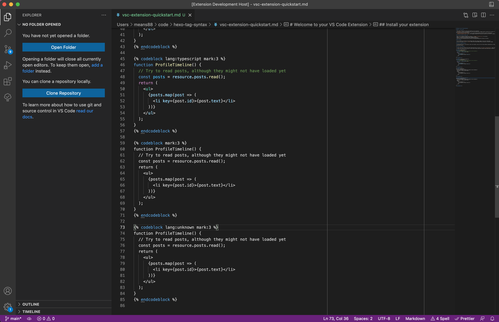

# VSCode Hexo Tag Syntax

Show code highlights inside hexo codeblock

[Install](https://marketplace.visualstudio.com/items?itemName=means88.vscode-hexo-tag-syntax)

## Usage

```

function ProfileTimeline() {
  // Try to read posts, although they might not have loaded yet
  const posts = resource.posts.read();
  return (
    <ul>
      {posts.map(post => (
        <li key={post.id}>{post.text}</li>
      ))}
    </ul>
  );
}

```

```

function ProfileTimeline() {
  // Try to read posts, although they might not have loaded yet
  const posts = resource.posts.read();
  return (
    <ul>
      {posts.map(post => (
        <li key={post.id}>{post.text}</li>
      ))}
    </ul>
  );
}

```


